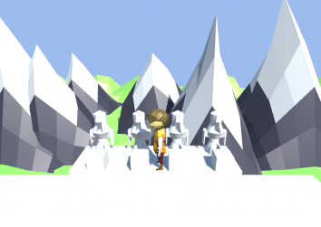
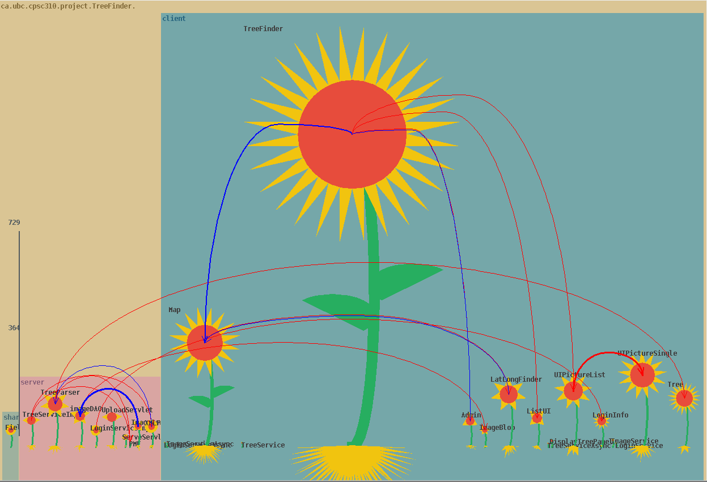
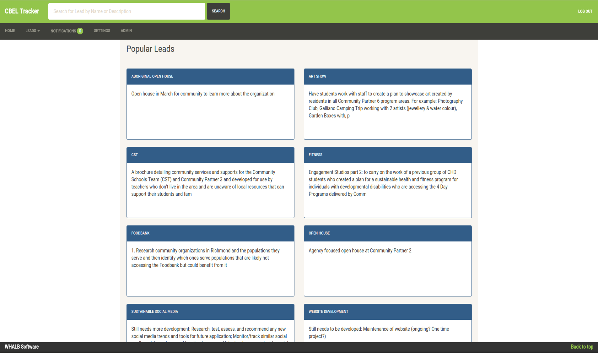
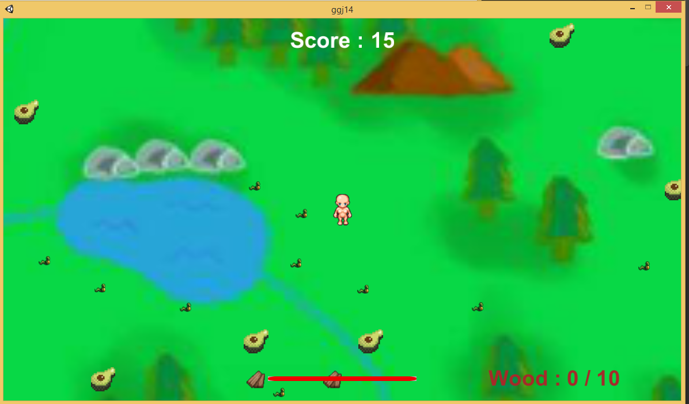
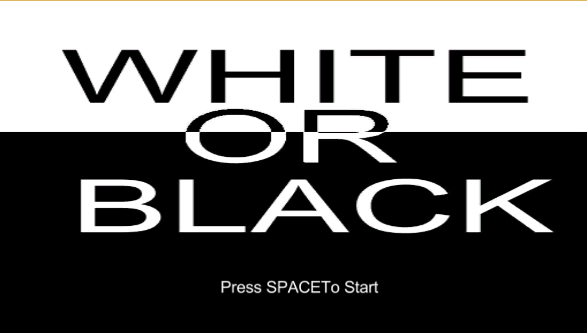
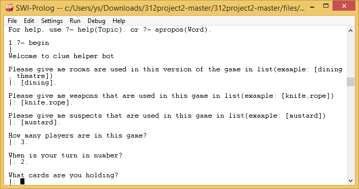
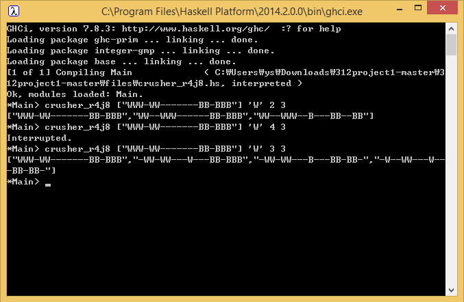

Here are some programming skills and projects that I tackled before

### Python

I use python in my work. In the work, I deal with full stack work, backend server, and some data manipulation with Panda library

### Go

 

Go is definitely fun/weird language. But I find it fun, and used it in my work and everytime I look, I find it fascinating. I use them mostly backend. Plus the logo is cute.

### BC Payroll Calculator

 

BC Simple Payroll Deduction Calculator is a simple and light-weight calculator that calculates amount of tax, cpp, and ei for employees. More features will be added and will be distributed for free in near future. Java and Swing was used.

Used Languages/Techniques
 * Java
 * Awt and Swing

[Github](https://github.com/yyssahn/PayrollCalculator)

### Source

 

Source is another game that was created at Global Game Jam event. It is a 2.5D platformer game where a player has to find restore balance before harmonic convergence. The Program is made by Unity using C# and the models were created with Blender. I worked on game physics and primarily on debugging and finding errors. I also worked to direct people to where they are needed.

 * Used Languages/Techniques
 * Unity
 * C#
 * Blender

[Github](https://github.com/krytical/GGJ2016)

[GGJ page](http://globalgamejam.org/2016/games/source)

### Robotonism

 

Robotonism is a program that takes other java program as input and returns an interclass relationship diagram in a form of flowers. The program was made by using Java and visually presented using Java Swing.

Used Languages/Techniques
 * Java
 * Awt and Swing

[Github](https://github.com/yyssahn/410project)

### CBEL Tracker

CBEL Tracker is an website made for an organization in UBC called Centre for Community Engaged Learning. The project was made to help them organize and track their system. 
The website helps storing, organizing, searching items in database and also notices user if any changes were to occur. The website was powered by LAMP(Linux, Apache, Mysql, PHP) and Bootstrap.

Used Languages/Techniques
 * LAMP server(Linux, Apache, MySQL, PHP)
 * HTML, Jquery, JavaScript
 * Bootstrap Framework
 * PHP

[Github](https://github.com/yyssahn/319project)

### I WILL SURVIVE

I will survive is a 2D Survival game created with my friends at Global Gaming Jam. It used Unity as its game engine and was created from scratch in 48 hours. It was implemented using C# and JavaScript and its images were drawn using Photoshop. The game's goal is to escape island before the main character's life is completely drained. The sprites and objects are placed randomly at the start of the game.

Used Languages/Techniques
 * Unity
 * C#
 * JavaScript
 * Photoshop

[Github](https://github.com/yyssahn/ggj15project)

### White or Black

White or Black is a Puzzle/Platformer game created with my friends at Global Gaming Jam. It used Unity as its main engine and was created from scratch in 48 hours. The goal of the game is to make both black piece and white piece to the destination. From time to time, black and white pieces needs to help each other out to reach the end. It was implemented using C# and JavaScript, using Unity as its game engine

Used Languages/Techniques
 * Unity
 * C#
 * JavaScript

[Github](https://github.com/yyssahn/ggj14)

### DNA Identifier

DNA Identifier is a program that takes a sequence of DNA(RNA) strands and matches it with the existing database of existing bacterias. It was implemented using Java and used Java Swing for Graphical User Interface

Used Technologies
 * Java
 * Awt and Swing
 * Java Database

[Github](https://github.com/jimmyshi/CPSC304)

### Clue Helper

An introductory prject on functional programming using Prolog

Used Technologies
 * Prolog
 
[Github](https://github.com/yyssahn/312project2)

### Game Planner

An introductory prject on functional programming using Haskell

Used Technologies
 * Haskell
 
[Github](https://github.com/yyssahn/312project1)
