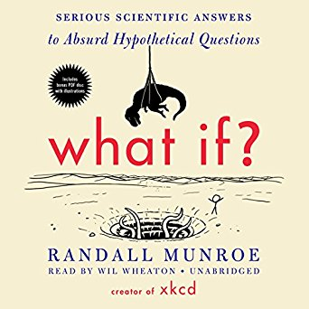
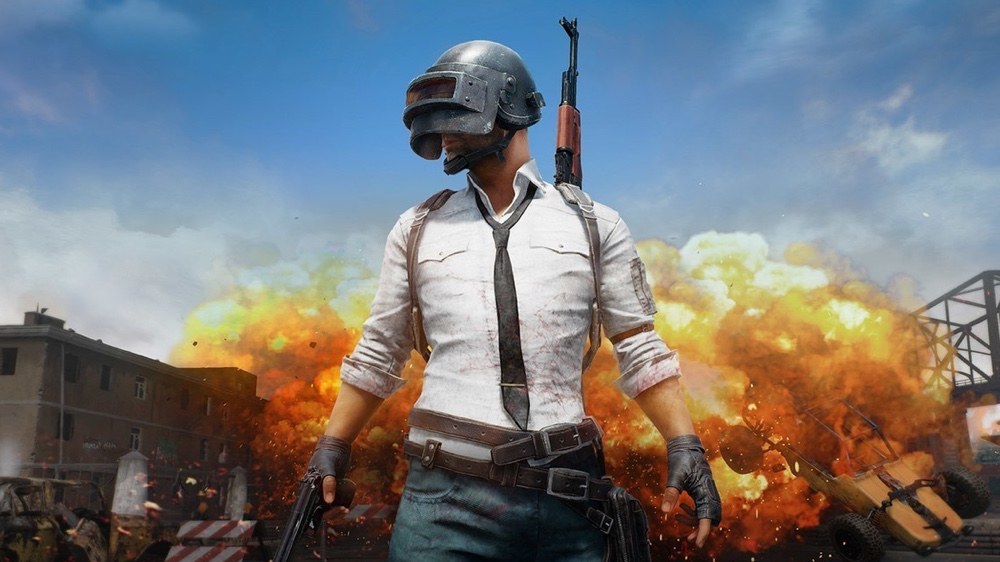

### Books

The field of computer science is so large and diverse that I always find something new to study.
Luckily I like learning new computer skills that I can prepare for the future.
Most of the books that I buy these days have something to do with programming.
But occasionally I buy random books be it fiction or science.  
Above is my random book I like, What if? by Randall Munroe

### Games

I used to play tonnes of games in my spare time. I have cut down considerably (at least from my university times) :)
But I do sped few hours a week in online world with my friends
I play League of Legends, Diablo 3, and some games that I buy from Steam. But these days I mostly play PUBG
I also have great interest in making games at events like Global Gaming Jam. 

### Exercise

I do try to keep a healthy life. I work out from time to time and like to take my bike to go to places.
This is a picture of me on some random mountain in Spain where I walked over 900km just because.