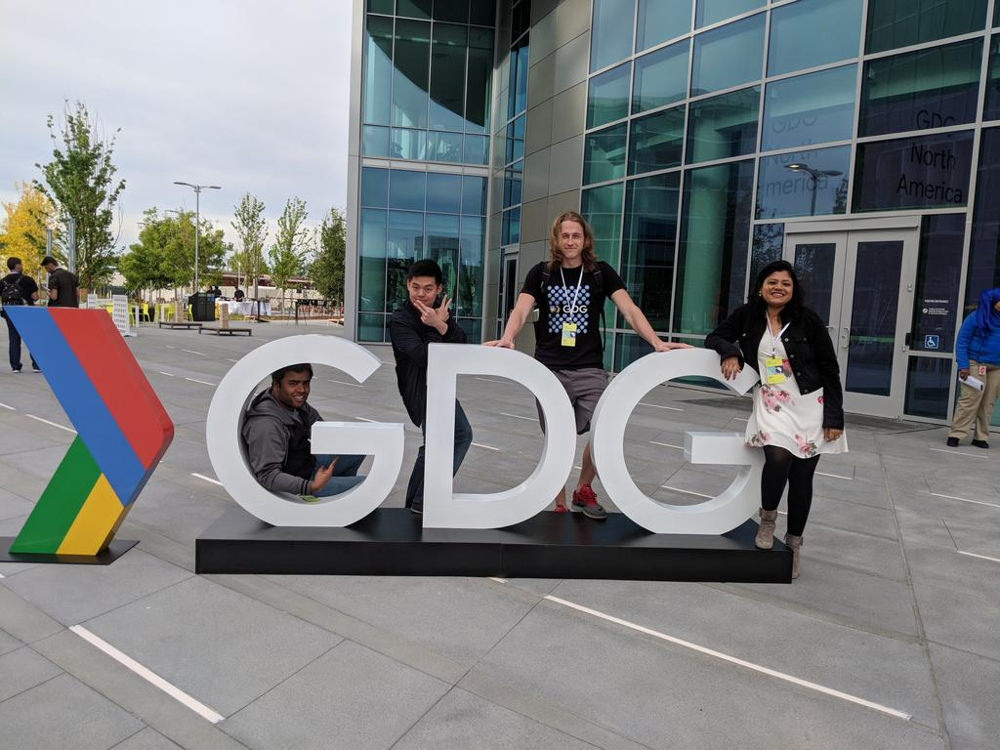

I am an organizer of community known as [Google Developer Group Cloud Vancouver](https://www.meetup.com/GDGCloudVancouver/) and I'm having an awesome amount of time.

These are my good friends who help me run GDG Cloud Vancouver, starting from the left, Vikram, Davey, and Piyali.

Not only is organzing event fun, but it also offers me so many different perks.

* **Networking** I meet so many people who are very smart, or people who don't know anything but come here because they are interested. They offer me so many different perspectives and ideas.
* **Knowledge** A lot of the workshops are sometimes on a topic that I am vaguely familiar with. It forces me to study because I don't want to look like a headless chickent when somebody asks me a question :P
* **Problem Solving Skills** Not a problem solving skill as in programming, but in terms of plannig things ahead, looking for problems, finding out solutions, improvising, etc

I have to say, I love being GDG organizer. It taught me to be social, solve different types of problems. I got invited to Google to join conferences where I met smartest people around the globe(and get drunk).

I usually am the guy who deals with venue, schedule an event, talk the details, and deal with sponsorship in our branch. I also do some presentation from time to time. If you are interested in GDGCV or sponsoring GDGCV, contact me!

